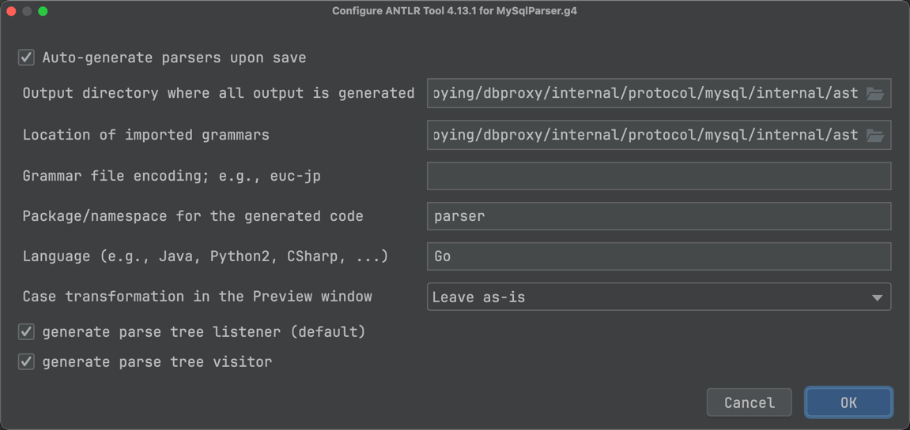

# 数据库网关

目前是基于 MySQL 协议 10 开发的。绝大多数情况下，你用的就是这个版本的协议。

注意这个是协议版本，不是你的数据库版本。

#### 介绍

数据库代理，我的理解中就是有三种形态：
- SDK 形态：也就是作为一个 SDK 直接给人使用
- Proxy 形态：也就是常规意义上的代理形态，需要独立部署
- Sidecar 形态：在云原生之下衍生出来的一种新的形态

如果仔细思考，就会发现这三种形态解决的问题都是一样，只是表现的形态并不一样。

因此本项目就是要构造一个新的代理实现，同时支持这三种形态。

## TODO
- 支持 prepare statement
- 支持 multiple statement

## 附录

### 使用 ANTLR 插件来生成 AST 语法树内容
你有两种方式来生成 ANTLR 代码。
- 直接在本地安装 ANTLR：参考 [antlr4-tools](https://github.com/antlr/antlr4/blob/master/doc/getting-started.md)
- 使用 Goland IDE 中的 ANTLR4 插件

如下图，右键点击 MySqlParser.g4 文件，选择配置：


而后则是：


### interpolateParams=false

在做类似的数据库代理的时候，有一个很麻烦的问题，就是 PrepareStatement 处理。

在目前不支持 PrepareStatement 的情况下，必须设置在 DSN 里面加上参数 interpolateParams=true。例如：
```go
	// 必须加上 interpolateParams=true
const dsn = "root:root@tcp(local.ubuntu:13316)/webook?interpolateParams=true"
```
这样从客户端传过来的 SQL 就是完整的 SQL。否则，驱动会用 prepare statement 来执行语句。

举个例子来说，在设置了`interpolateParams=true`的情况下，查询：
```go
	_, err = db.Query("SELECT * FROM `users` WHERE id=?", 1)
```
等价于：
```go
	_, err = db.Query("SELECT * FROM `users` WHERE id=1")
```
但是这个存在 SQL 注入的极低的风险，SQL 的驱动会尽量帮我们转义处理各种特殊字符，以规避潜在的 SQL 注入的风险。

同时要注意，在 GO 驱动里面就是 interpolateParams=true，在别的驱动里面我不是特别清楚，你需要阅读文档。

### 弱校验
网关在实现过程中并没有类似于 MySQL 服务端那样执行强校验。

例如说在报文格式上，我们默认收到的报文是符合 MySQL 报文格式的。如果不符合 MySQL 报文格式，也就是说这是一个非法报文，可能出现的情况是：
- 发生 panic
- 解析得到错误数据，出现难以预料的后果

通过假设我们这里收到的都是合法的报文，可以省略掉很多累赘的代码。这个假设是非常合理的，因为我们预期你的网关应该是运行在一个可控的环境下，也就是说总是用合法的 MySQL 驱动来连接网关，那么产生的报文是必然正确的。

### AutoCommit 
为了兼容 MySQL 协议，因此我们网关会假装自己处于一种 auto commit 状态

### MySQL 服务器发起 handshake 的数据例子

原始数据：
```shell
[10 56 46 48 46 50 57 0 42 1 0 0 72 5 38 113 123 48 57 121 0 255 255 255 2 0 255 223 21 0 0 0 0 0 0 0 0 0 0 34 51 65 75 9 123 34 40 103 34 60 38 0 109 121 115 113 108 95 110 97 116 105 118 101 95 112 97 115 115 119 111 114 100 0]
[10 56 46 48 46 50 57 0 43 1 0 0 119 3 72 21 22 118 3 118 0 255 255 255 2 0 255 223 21 0 0 0 0 0 0 0 0 0 0 32 114 66 110 10 69 68 46 50 92 29 78 0 109 121 115 113 108 95 110 97 116 105 118 101 95 112 97 115 115 119 111 114 100 0]
```
00000010 00000000
解析之后：
```shell
[10 
56 46 48 46 50 57 0 
42 1 0 0 
72 5 38 113 123 48 57 121
0 
255 255
255
2 0 
255 223 
21
0 0 0 0 0 0 0 0 0 0 
34 51 65 75 9 123 34 40 103 34 60 38 0
109 121 115 113 108 95 110 97 116 105 118 101 95 112 97 115 115 119 111 114 100 0]
```
各个部分的含义：
- 10：这是 mysql 协议的版本，目前支持的就是 10
- 56 46 48 46 50 57 0: 一个可读的数据库版本号，在这里是 8.0.29
- 42 1 0 0：线程 ID，或者连接 ID
- 72 5 38 113 123 48 57 121：auth-plugin-data-part-1，后面还有一个 part2
- 0：auth-plugin-data-part-1 结束的标记位
- 255 255：capability_flags_1，也就是数据库支持一些什么的标记位
- 255：字符集
- 2 0：数据库状态
- 255 223：capability_flags_2，数据库支持的功能的标记位的第二部分
- 21：auth_plugin_data_len 鉴权数据的长度
- 0 0 0 0 0 0 0 0 0 0：保留
- 34 51 65 75 9 123 34 40 103 34 60 38 0：auth-plugin-data-part-2，这部分是以 0 为结尾的，加上 auth-plugin-data-part-1 中的八个字节，恰好等于 21
- 109 121 115 113 108 95 110 97 116 105 118 101 95 112 97 115 115 119 111 114 100 0：auth_plugin_name