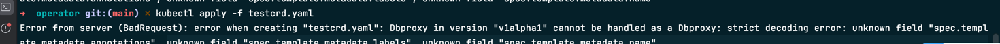
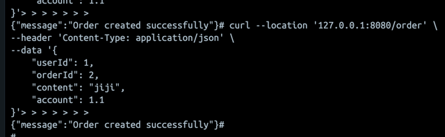
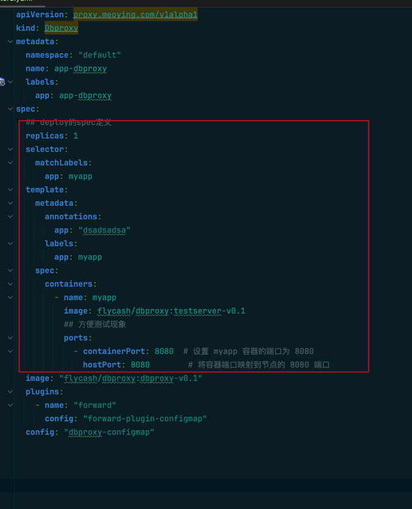

## 环境
k8s (kind搭建 https://kind.sigs.k8s.io/docs/user/quick-start/)

go v1.22 

## 自定义资源解析
1. 定义出crd（自定义资源）Dbroxy （该crd是spec是 deployment的spec + dbproxy容器 的定义）
```shell
apiVersion: proxy.meoying.com/v1alpha1
kind: Dbproxy
metadata:
  namespace: "default"
  name: app-dbproxy
  labels:
    app: app-dbproxy
spec:
  ## deploy的spec定义
  replicas: 1
  selector:
    matchLabels:
      app: myapp
  template:
    metadata:
      annotations:
        app: "dsadsadsa"
      labels:
        app: myapp
    spec:
      containers:
        - name: myapp
          image: flycash/dbproxy:testserver-v0.1
          ## 方便测试现象
          ports:
            - containerPort: 8080  # 设置 myapp 容器的端口为 8080
              hostPort: 8080        # 将容器端口映射到节点的 8080 端口
  ## 比deployment多了下面三个对象      
  ## dbproxy的镜像      
  image: "flycash/dbproxy:dbproxy-v0.1"
  ## dbproxy使用的插件
  plugins:
    - name: "forward" # 插件名称
      config: "forward-plugin-configmap" # forward-plugin-configmap为插件的配置文件（以configmap部署）最后的configmap的名称
  config: "dbproxy-configmap" ## dbproxy的配置文件（以configmap部署）是configmap的名称
```


## 如何开发dbpoxy的operator

### 工具

#### 名称 
Operator Framework 

#### 安装
```shell
mac
brew install operator-sdk
其他可以查看
https://sdk.operatorframework.io/docs/installation/
```

#### 初始化operator项目
```shell
可以查看下面这个文档
https://sdk.operatorframework.io/docs/building-operators/golang/quickstart/

mkdir demo
operator-sdk init --domain meoying.com --repo github.com/meoying/dbproxy --plugins=go/v4
## 创建api
operator-sdk create api --group proxy --version v1alpha1 --kind Dbproxy --resource --controller

make
```

#### 项目结构
我们主要需要编写的是目录下面的 api 定义以及对应的 internal/controller 实现。


### 开发operator

#### 定义api
```shell
type DbproxySpec struct {
	// deployment的spec的定义
	Replicas                *int32                    `json:"replicas,omitempty" protobuf:"varint,1,opt,name=replicas"`
	Selector                *metav1.LabelSelector     `json:"selector" protobuf:"bytes,2,opt,name=selector"`
	Template                PodTemplateSpec           `json:"template" protobuf:"bytes,3,opt,name=template"`
	Strategy                appsv1.DeploymentStrategy `json:"strategy,omitempty" patchStrategy:"retainKeys" protobuf:"bytes,4,opt,name=strategy"`
	MinReadySeconds         int32                     `json:"minReadySeconds,omitempty" protobuf:"varint,5,opt,name=minReadySeconds"`
	RevisionHistoryLimit    *int32                    `json:"revisionHistoryLimit,omitempty" protobuf:"varint,6,opt,name=revisionHistoryLimit"`
	Paused                  bool                      `json:"paused,omitempty" protobuf:"varint,7,opt,name=paused"`
	ProgressDeadlineSeconds *int32                    `json:"progressDeadlineSeconds,omitempty" protobuf:"varint,9,opt,name=progressDeadlineSeconds"`
	// dbproxy的配置
	Image   string         `json:"image"`
	Plugins []PluginConfig `json:"plugins"`
	Config  string         `json:"config"`
}
```
这里为什么我没有直接写成 deploySpec appsv1.DeploymentSpec `json:"deploySpec"`。原因在于这样写我在定义deployment.template.metadata 下面的任何属性都没办法接收到，类似下面这个报错。我直接铺开到没这样的问题了。具体原因我还要去研究研究



### 调试
首先在集群中安装crd对象
make install
查看有没有安装成功
kubectl get crd
启动operator的服务
make run

### 运行

```shell
kubectl apply -f testcrd.yaml
校验是否成功进入node节点，执行
curl --location '127.0.0.1:8080/order' \
--header 'Content-Type: application/json' \
--data '{
    "userId": 1,
    "orderId": 2,
    "content": "jiji",
    "account": 1.1
}'
```



### 如何修改crd适配自己的业务

将上图红框部分替换成你业务的deployment的spec定义，现在只支持deployment

## 部署
```shell
make docker-build flycash/dbproxy/operatordemo:v0.1
```


