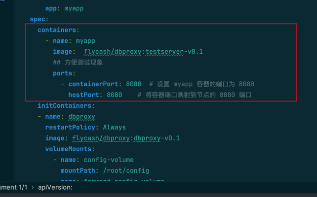

## 环境搭建
k8s搭建   (kind搭建 https://kind.sigs.k8s.io/docs/user/quick-start/)

## sidecar_container描述
参考如下文档
https://kubernetes.io/zh-cn/docs/concepts/workloads/pods/sidecar-containers/


## 项目结构
```shell
.
├── Makefile
├── README.md
├── config.yaml
├── dbproxy.yaml
└── forward_config.yaml
```
#### dbproxy.yaml: 定义了应用容器，和dbproxy的sidecar容器
```yaml
apiVersion: apps/v1
kind: Deployment
metadata:
  name: myapp
  labels:
    app: myapp
spec:
  replicas: 1
  selector:
    matchLabels:
      app: myapp
  template:
    metadata:
      labels:
        app: myapp
    spec:
      containers:
        - name: myapp
          image:  flycash/dbproxy:testserver-v0.1
          ## 方便测试现象
          ports:
            - containerPort: 8080  # 设置 myapp 容器的端口为 8080
              hostPort: 8080    # 将容器端口映射到节点的 8080 端口
      initContainers:
      - name: dbproxy
        restartPolicy: Always
        image: flycash/dbproxy:dbproxy-v0.1
        volumeMounts:
          - name: config-volume
            mountPath: /root/config
          - name: forward-config-volume
            mountPath: /root/plugin/forward/config
      volumes:
        - name: config-volume
          configMap:
            name: dbproxy-configmap
            items:
              - key: config.yaml
                path: config.yaml
        - name: forward-config-volume
          configMap:
            name: forward-plugin-configmap
            items:
              - key: config.yaml
                path: config.yaml
```
initContainers: 这部分定义的就是dbproxy的容器

restartPolicy: 重启策略

image：镜像

config-volume： 为dbproxy的配置文件，里面定义dbproxy暴露的端口和开放的插件配置文件，如果你想替换插件，首先需要修改dbproxy镜像，将那些插件编译进去。然后替换配置文件。插件的配置文件规则 /root/plugin/插件名/config

forward-config-volume： 为forward插件（直连）的配置文件

volumes: 定义了两个Volume，也就是上面volumeMounts具体内容。

#### config.yaml
定义了dbproxy本身的配置文件是，以configMap的是想部署到k8s中的
```shell
apiVersion: v1
kind: ConfigMap
metadata:
  name: dbproxy-configmap
data:
  config.yaml: |
    server:
      addr: ":8307"
    plugins:
      location: "./plugins"
      items:
        - name: "forward"
          location: "./plugin/forward"
          configLocation: "./plugin/forward/config"

```
server： 指定了dbproxy暴露的端口
plugins： 指定了插件的配置文件
plugins.location: 指定了默认的插件加载位置
plugins.items: 是一个列表，里面的元素为一个个插件的定义
plugins.items[0].name: 插件名称
plugins.items[0].location: 插件目录
plugins.items[0].configLocation: 插件配置文件目录

#### forward_config.yaml
定义了forward插件的配置文件，也是以configmap的形式部署到k8s中的
```shell
apiVersion: v1
kind: ConfigMap
metadata:
  name: forward-plugin-configmap
data:
  config.yaml: |
    dsn: "root:root@tcp(mysql-service:3306)/order_db?charset=utf8mb4&parseTime=True&loc=Local"
```
如果另外指定数据库就替换dsn部分


## 如何修改业务使用dbproxy

将图中画红框的部分替换成你业务的容器。


## 运行
```shell
make 
查看现象
在node节点上访问
curl --location '127.0.0.1:8080/order' \
--header 'Content-Type: application/json' \
--data '{
    "userId": 1,
    "orderId": 2,
    "content": "jiji",
    "account": 1.1
}'

返回{"message":"Order created successfully"}表示成功插入，可以进测试pod的mysql容器直接查看插入的数据
 kubectl exec -ti test-pod1 -c mysql -- /bin/bash

```
