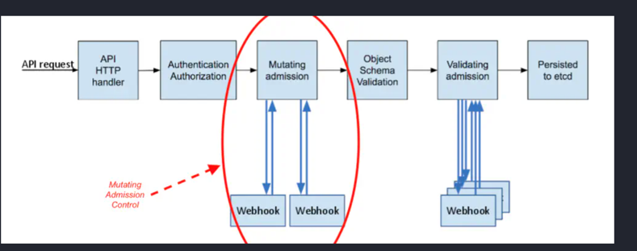

##  基本思路
使用MutatingAdmissionWebhook，去修改pod对象,将sidecar容器注入到pod中



## 部署

### 证书
k8s只支持https通信所以需要安装证书
```
自己颁发证书
cat > ca-config.json <<EOF
{
  "signing": {
    "default": {
      "expiry": "8760h"
    },
    "profiles": {
      "server": {
        "usages": ["signing", "key encipherment", "server auth", "client auth"],
        "expiry": "8760h"
      }
    }
  }
}
EOF
cat > ca-csr.json <<EOF
{
    "CN": "kubernetes",
    "key": {
        "algo": "rsa",
        "size": 2048
    },
    "names": [
        {
            "C": "CN",
            "L": "BeiJing",
            "ST": "BeiJing",
            "O": "k8s",
            "OU": "System"
        }
    ]
}
EOF

cat > server-csr.json <<EOF
{
  "CN": "dbproxy",
  "key": {
    "algo": "rsa",
    "size": 2048
  },
  "names": [
    {
        "C": "CN",
        "L": "BeiJing",
        "ST": "BeiJing",
        "O": "k8s",
        "OU": "System"
    }
  ]
}
EOF

创建ca证书
 cfssl gencert -initca ca-csr.json | cfssljson -bare ca
为服务端创建证书
cfssl gencert -ca=ca.pem -ca-key=ca-key.pem -config=ca-config.json \
		-hostname=dbproxy-webhook.default.svc -profile=server server-csr.json | cfssljson -bare server
注意：其中hostname参数需要修改格式为 {service-name}.{service-namespace}.svc
service-name 代表你 webhook 的 Service 名字，service-namespace 代表你 webhook 的命名空间。

创建secret然后挂载到webhook的容器中
kubectl create secret tls dbproxy-webhook-tls \
        --key=server-key.pem \
        --cert=server.pem
secret/dbproxy-webhook-tls created
```
### 启动webhook服务
```shell
kubectl apply -f webhook.yaml
```


### 注册webhook
```shell
kubectl apply -f register.yaml
## 注意
caBundle: 指定ca证书来表示apiserver作为客户端来验证服务端的证书
cat ca.pem | base64 
执行上面命令得到的字符串，作为caBundle的值。

```

### 设置dbproxy的配置文件
```shell
kubectl apply -f dbproxy/config.yaml
kubectl apply -f dbproxy/forward_config.yaml
kubectl create configmap  mysql-init-script-configmap --from-file=init.sql
```

### 创建测试用的pod
```shell
## 使用deployment（deploy-server.yaml）部署或者直接以pod形式部署（server.yaml）
kubectl apply -f deploy-server.yaml
```

### 验证
```shell
## 在node节点访问http服务
curl --location '127.0.0.1:8080/order' \
--header 'Content-Type: application/json' \
--data '{
    "userId": 1,
    "orderId": 2,
    "content": "jiji",
    "account": 1.1
}'
返回{"message":"Order created successfully"}表示成功插入，可以进测试pod的mysql容器直接查看插入的数据
 kubectl exec -ti test-pod1 -c mysql -- /bin/bash

```
